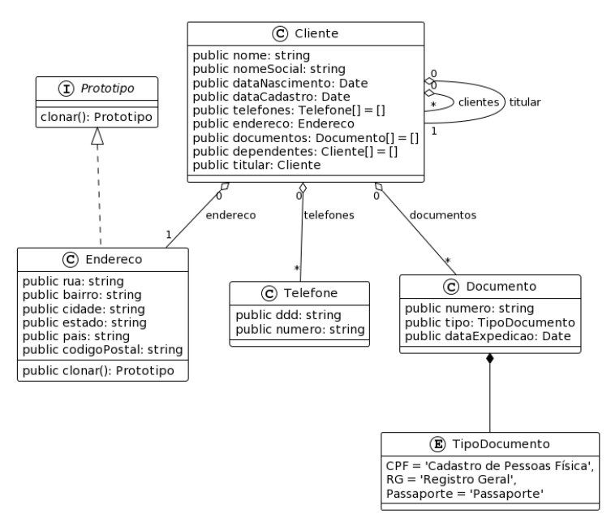

## Atividade I

Empresa criada: Ocean Solutions

Fundador, Dev e Engenheiro de Software: André Salerno

- Sistema: Atlantis
- Fase: concepção (MVP)
- Perfil: generalista
- Objetivo: nesse primeiro módulo faremos o cadastramento de clientes e seus dependentes (convidados)
- Quem é o cliente?

Uma pessoa que irá usufruir dos serviços do parque, clube ou hotel.

Obs.: todo convidado(dependente) tem um responsável, os dados de endereço e telefones do dependente devem ser iguais aos dados do responsável

## Diagrama de classe




### Histórico de comandos

```powershell

git remote remove origin

```

```powershell

git remote -v  # Lista os remotes
git remote remove origin  # Remove o remote original


```

```powershell

git remote add origin https://github.com/andresalerno/atvi-atlantis.git

```

```powershell

git branch -M main

```

```powershell

git checkout -b dev

```

```powershell

git add .

```

```powershell

git commit -m "ajustes iniciais com pastas para back e frontend"

```

```powershell

git push -u origin dev

```
